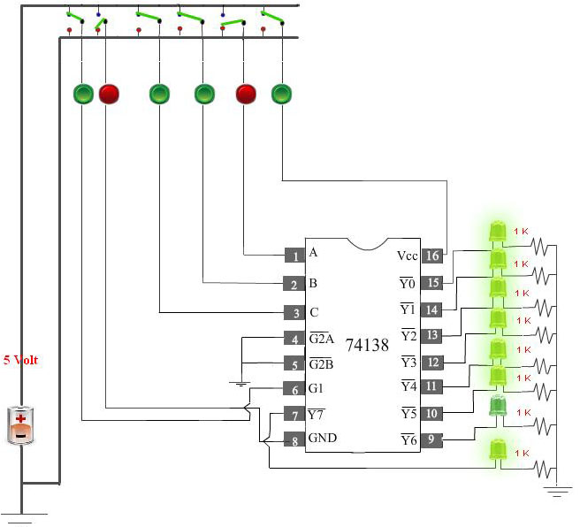
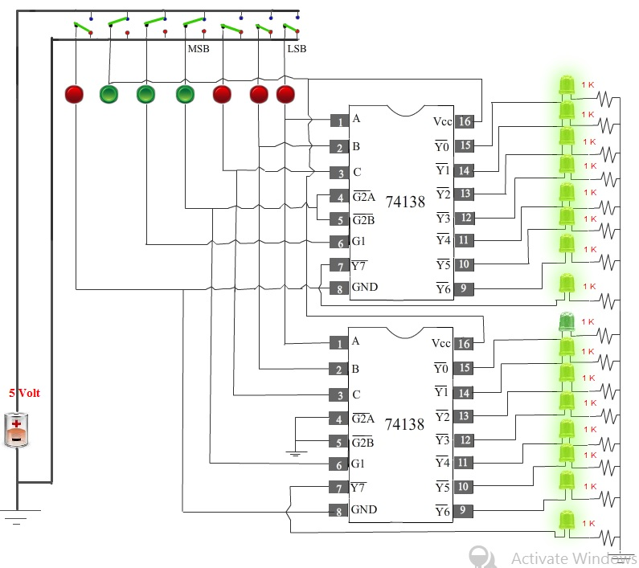
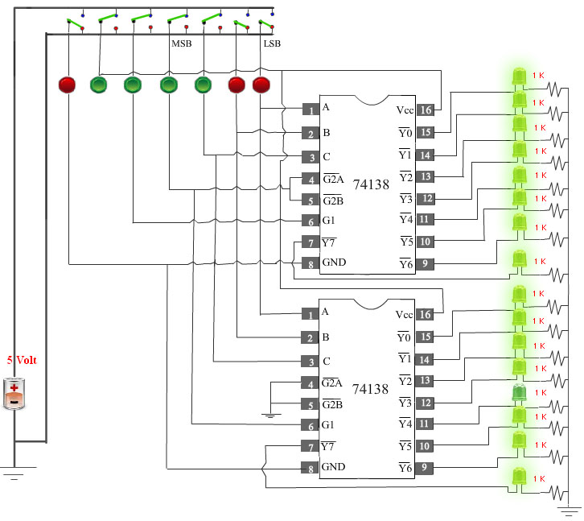
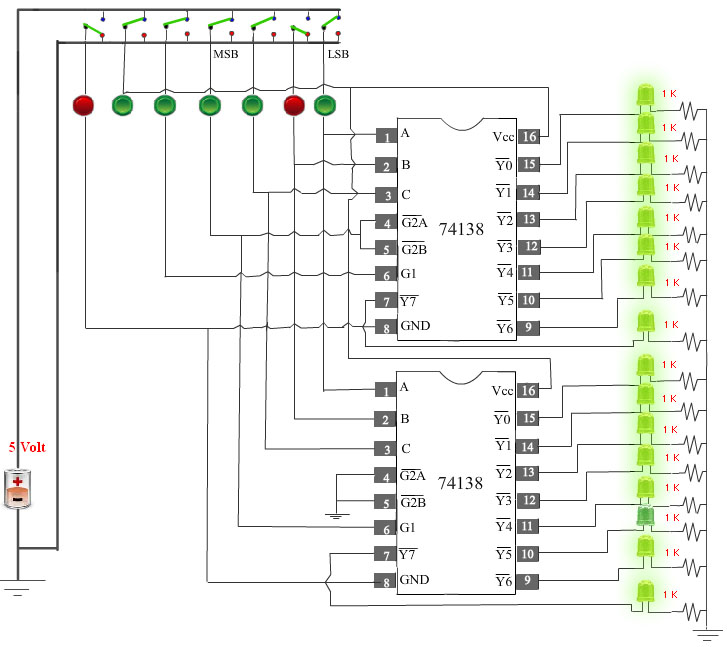
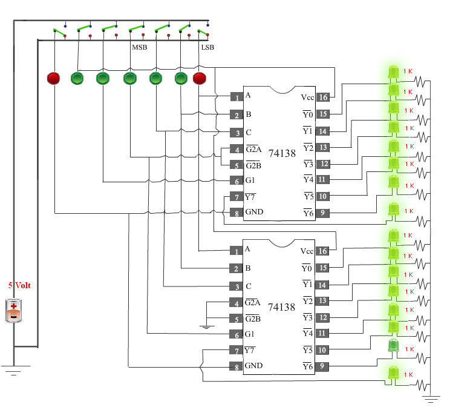
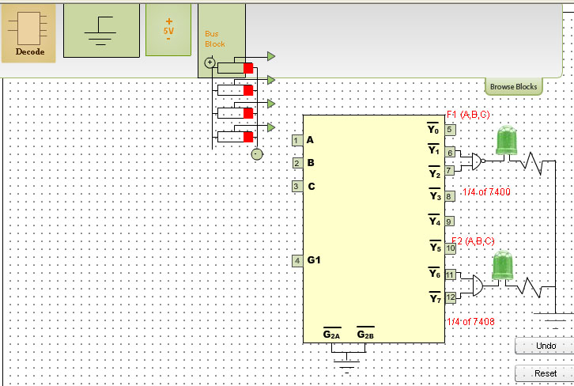
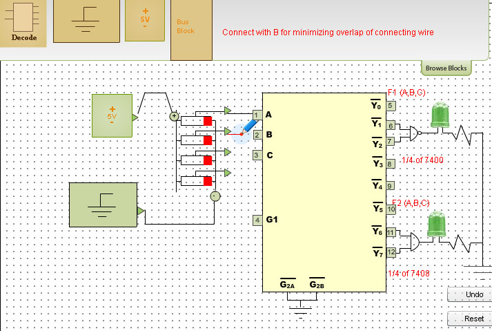
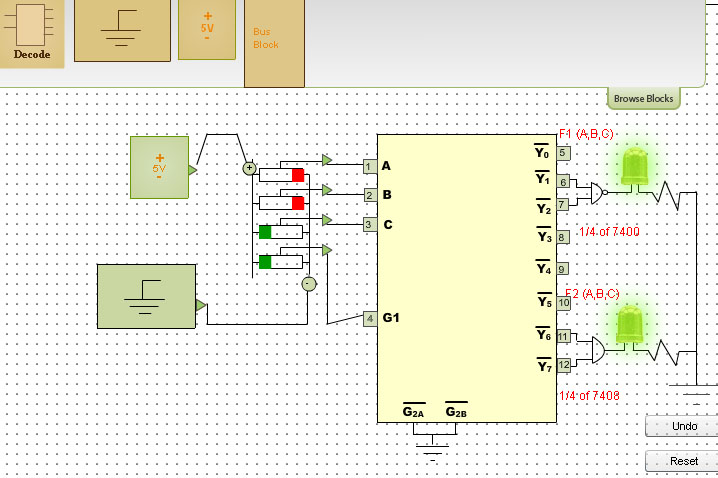

### Procedure

                            
                            

Please follow these steps to do the experiment.

                             
                             
                            

Part 1:

                          
                             
                            
                            
                         
<ul style="list-style:none">
                            
 <li class="expt1">	1.&nbsp;At first go through the structure of 74138.
 Then apply  high level voltage to VCC  and apply low level voltage  to GND  and also apply  high level voltage to G1.
</li>
 </ul>
                                 
                                
 
                                 
                               
 <ul style="list-style:none">
                            
  <li class="expt1">	2.&nbsp;Next, apply low level voltage  to all the three select inputs (C B A).
                                Now check that Y0 is at low state. Other outputs are at high state.
</li>
</ul>

  
                                
 
                                 
                            	 <ul style="list-style:none">
                            
 <li class="expt1">	3.&nbsp;Next,  apply low level voltage  to C  and  B  and apply  high level voltage to A.Now check that 
 Y1 is at low state. Other outputs are at high state.
</li>
</ul>
 

                                 

                                
<ul style="list-style:none">
                            
 <li class="expt1">	4.&nbsp;Next,  apply low level voltage  to  C  and A  and apply  high level voltage to B.Now check that 
 Y2 is at low state. Other outputs are at high state.
</li>
</ul>
 
                                
   
                                    
                                
                                
<ul style="list-style:none">
                            
<li class="expt1">	5.&nbsp;Next,  apply low level voltage  to  C  and apply  high level voltage to B  and A.
                                Now check that Y3 is at low state. Other outputs are at high state.
</li>
</ul>
 
                                
   
                                  
                                
                                
 <ul style="list-style:none">
                            
<li class="expt1">	6.&nbsp;Next,  apply  high level voltage to  C  and apply low level voltage  to B and A. Now check that 
Y4 is at low state. Other outputs are at high state.
</li>
</ul>
 
                                
   
                                  
                                
                                
 <ul style="list-style:none">
                            
 <li class="expt1">	7.&nbsp;Next,  apply  high level voltage to C and A and apply low level voltage  to B.Now check that
                            Y5 is at low state. Other outputs are at high state.
</li>
</ul>
 
                                
   
                                                                         
                        
  <ul style="list-style:none">
                             <li class="expt1">	8.&nbsp;Next,  apply  high level voltage to  C and B high  and apply low level voltage  to A.  Now check that 
                              Y6 is at low state. Other outputs are at high state.
</li>
</ul>
 
                                
   
                                   
                                
  <ul style="list-style:none">
                            
<li class="expt1">	9.&nbsp;Next,  apply  high level voltage to all the select inputs (C,B,A). Now check that
                                Y7 is at low state. Other outputs are at high state.
</li>
</ul>
 
                                
   
                                  
                                 
                                
Please follow these steps to do the experiment(Part2).

                                 
<ul style="list-style:none">
                            
 <li class="expt1">	1.&nbsp;At first  apply  high level voltage to VCC  and apply low level voltage to GND andapply  high level voltage to  G1 input of 1st decoder.
</li>
                            	
  </ul>
                                 

                                 
                                
<ul style="list-style:none">
                            
 <li class="expt1">	2.&nbsp;Next,  apply low level voltage to all the four select inputs (MSB,C B A).Now check that 
    
                        
Y0 (1st Decoder) is at low state. Other outputs are at high state.
</li>
                            	
 </ul>
                                 
                                
 
                                 
                                
                                
 <ul style="list-style:none">
                            
 <li class="expt1">	3.&nbsp;Next,  apply  high level voltage to  A and apply low level voltage to all other select inputs (MSB,C B).Now check that
                                 Y1 (1st Decoder) is at low state. Other outputs are at high state.
</li>
                            	
</ul>
                                 
                                
 
                                 
                                
                                
 <ul style="list-style:none">
                            
<li class="expt1">4.&nbsp;Next,  apply  high level voltage to B  and apply low level voltage to all other select inputs (MSB,C, A ). Now check that
                                Y2 (1st Decoder) is at low state. Other outputs are at high state.
</li>
                            	
  </ul>
                                 
                                
 
                                 
                                
                                
 <ul style="list-style:none">
                            
<li class="expt1">5.&nbsp;Next, apply  high level voltage to A and B and apply low level voltage to all other select inputs (MSB,C )low. Now check that
                                Y3 (1st Decoder) is at low state. Other outputs are at high state.
</li>
                            	
 </ul>
                                 
                                

                                 
                                 <ul style="list-style:none">
                            
<li class="expt1">6.&nbsp;Next,  apply high level voltage to C and apply low level voltage to all other select inputs (MSB,B,A ). Now check that
                                Y4 (1st Decoder) is at low state. Other outputs are at high state.
</li>
                            	
  </ul>
                                 
                                
  
                                 
                                 
                                 
                                 
 <ul style="list-style:none">
                         <li class="expt1">7.&nbsp;Next, apply high level voltage to C  and A  and apply low level voltage to all other select inputs (MSB,B ).Now check that
                                 Y5 (1st Decoder) is at low state. Other outputs are at high state.
</li>
                            	
</ul>
                                 
                                
 
                                 
                                     
                                     
                                     
                                     
<ul style="list-style:none">
                            
 <li class="expt1">8.&nbsp;Next,  apply high level voltage to C  and B   and apply low level voltage to all other select inputs (MSB,A ). Now check that
                                Y6 (1st Decoder) is at low state. Other outputs are at high state.
</li>
                            	  </ul>
                                 
                                

                                     
                                
                                
                                
                                      
 <ul style="list-style:none">
                            
 <li class="expt1">9.&nbsp;Next,  apply high level voltage to C , B  and A high  and  apply low level voltage to   (MSB)input.  Now check that
                               Y7 (1st Decoder) is at low state. Other outputs are at high state.
</li>
                            	
 </ul>
                                 
                                
 
                                   
                                
                                
<ul style="list-style:none">
                            
 <li class="expt1">10.&nbsp;Next,  apply high level voltage to MSB  and  apply low level voltage to all other select inputs (C,B,A). Now check that
                                Y0 (2nd Decoder) is at low state. Other outputs are at high state.
</li>
                            	
  </ul>
                                 
                                

                                   
                                
 <ul style="list-style:none">
                            
 <li class="expt1">11.&nbsp;Next, apply high level voltage to MSB and A  and apply low level voltage to all other select inputs (C,B).
                                Now check that Y1(2nd Decoder) is at low state. Other outputs are at high state.
</li>
                            	
 </ul>
                                 
                                
 
                                       
                                
                                
                                
<ul style="list-style:none">
                            
 <li class="expt1">12.&nbsp;Next,  apply high level voltage to MSB and B  and apply low level voltage to all other select inputs(C,A).
                                Now check that Y2 (2nd Decoder) is at low state. Other outputs are at high state.
</li>
                            	 </ul>
                                 
                                 
                                      
                                
 <ul style="list-style:none">
                            
 <li class="expt1">13.&nbsp;Next,  apply high level voltage to  MSB , B and A  and apply low level voltage to  the input (C). Now check that
                                Y3 (2nd Decoder) is at low state. Other outputs are at high state.
</li>
                            	
  </ul>
                                 
                                
 
                                   
                                
 <ul style="list-style:none">
                            
<li class="expt1">14.&nbsp;Next,  apply high level voltage to MSB and C  and apply low level voltage to all other select inputs (B,A).
                                Now check that Y4 (2nd Decoder) is at low state. Other outputs are at high state.
</li>
                            	
 </ul>
                                 
                                
 
                                    
                                
 <ul style="list-style:none">
                            
<li class="expt1">15.&nbsp;Next,  apply high level voltage to MSB , C and A  and apply low level voltage to the select input (B). Now check that
                                Y5 (2nd Decoder) is at low state. Other outputs are at high state.
</li>
             </ul>
                                 
                                
 
                                    
                                
                                
                                
<ul style="list-style:none">
                            
<li class="expt1">16.&nbsp;Next,  apply high level voltage to MSB , C and B  and apply low level voltage to  the input (A).Now check that
                                 Y6 (2nd Decoder) is at low state. Other outputs are at high state.
</li>
                            	
 </ul>
                                 
                                
 
                                       
                                
                                
                                
 <ul style="list-style:none">
                            
<li class="expt1">17.&nbsp;Next,  apply high level voltage to all the select inputs (MSB,C,B,A).   Now check that
                              Y7 (2nd Decoder) is at low state. Other outputs are at high state.
</li>
                            	
 </ul>
                                 
                                
                                  
                               
                              
 
Part 3:

                                
<ul style="list-style:none">
                                <li class="expt1">1.&nbsp;At first click on the Browse Block button</li>
                                <li class="expt1">2.&nbsp;Next, drag the Decoder block and drop it onto the bread board.</li>
                                <li class="expt1">3.&nbsp;Next, drag the mux block and drop it onto the bread board.</li>
              
                                
 </ul>
                                 
                               

                                 
                                 
                               

                                 
                                 
                               
                                
 
                                 
                                
 <ul style="list-style:none">
                               
 <li class="expt1">4.&nbsp;Next, drag the Bus block and drop it onto the bread board.</li>
                                
                                
</ul>
                                 
                                
                                
 
                                 
                                 
                               
 
                                 
                                
                                
 <ul style="list-style:none">
                               
 <li class="expt1">5.&nbsp;Next, drag the Voltage block and drop it onto the bread board.</li>
                                
                                
  </ul>
                                
  
                               
  
                                 
                                 
                               

                                 
                                
                                
 <ul style="list-style:none">
                               
 <li class="expt1">6.&nbsp;Next, drag the Ground block and drop it onto the bread board.</li>
                                
                                
  </ul>
                                
  
                               
 
                                 
                                 
                                
 
                                  
                                
                                
  <ul style="list-style:none">
                                
                                
                               
 <li class="expt1">7.&nbsp;Next, make a connection from voltage block to positive end of the bus block.</li>
                                
                                
 </ul>
                                
                                
    
                               
 
                               
                                
   
                                 
                                
                               
    
                                
                                
 <ul style="list-style:none">
                               
 <li class="expt1">8.&nbsp;Next, make a connection from ground block to negitive end of the bus block.</li>
                                
                                
 </ul>
                                
                                 
  
                                 
                                
                                  
                                 
                                
                               
 
                                
  
                                   
  
The 4 switches constituting the Bus Block are denoted as A,B,C and D as one goes bottomwards starting with the top switch A .

                                
<ul style="list-style:none">
                               
 <li class="expt1">9.&nbsp;Next, make a connection from switch A to A of the Decoder block.</li>
                                
                                
</ul>
                                 
                                

                                 
                                 
                               

                                
  
                                 
  <ul style="list-style:none">
                               
 <li class="expt1">10.&nbsp;Next, make a connection from switch B to B of the Decoder block.</li>
                                
                                
  </ul>
                                
 
                                
 
                                 
                                 
                               
 
                                
  
                                 
                                 
<ul style="list-style:none">
                               
  <li class="expt1">11.&nbsp;Next, make a connection from switch C to C of the Decoder block.</li>
                                
                                
 </ul>
                                
  
                                

                                 
                                 
                               
 
                                
  
                                 
                                 
<ul style="list-style:none">

 <li class="expt1">12.&nbsp;Next, make a connection from switch D to G1 of the MUX block.</li>
                                
                                
</ul>
                                
  
                                
 
                                 
                                 
                               
 
                                 
                                
 
                                 
                                 
                                  
                                
                                
                                
 <ul style="list-style:none">
 <li class="expt1">13.&nbsp;Next, apply high level voltage to G1.</li>
                                             
                                             
                                             
 <li class="expt1">14.&nbsp;Next, apply low level voltage to (A, B, C) input.</li>
                                             
 <li class="expt1">15.&nbsp;Now check that output F2 attains logic high state.</li>
                                
                                
</ul>
                                
   
                                
 
                                 
                               
                               
  <ul style="list-style:none">
                               
                                             
                                             
<li class="expt1">16.&nbsp;Next,  apply low level voltage to  A(MSB) and  B and apply high level voltage to C(LSB).</li>
                                             
                                             
                                             
 <li class="expt1">17.&nbsp;Now check that output F1 and  F2 both attain logic high state.</li>
                                
 </ul>
                                
    
                                
 
                                 
                               
                               
                               
  <ul style="list-style:none">
                               
                                             
                                             
  <li class="expt1">18.&nbsp;Next,  apply high level voltage to B and apply low level voltage to A(MSB)&nbsp; C(LSB).</li>
                                             
                                             
                                             
 <li class="expt1">19.&nbsp;Now check that output F1 and  F2 both attain logic high state.</li>
                                
                                
</ul>
                                
 
                                
   
                                 
                                
                                
                                
 <ul style="list-style:none">
                               
                                             
                                             
  <li class="expt1">20.&nbsp;Next, apply high level voltage to C and B and apply low level voltage to A(MSB).</li>
                                             
                                             
 <li class="expt1">21.&nbsp;Now check that that output F2 attains logic high state.</li>
                                
                                
 </ul>
                                
 
                                

                                 
                                
<ul style="list-style:none">
                                 <li class="expt1">
                                22.&nbsp;For all the combinations of the select inputs A,B,C verify that both the LEDs are glowing 
                                or not glowing. If the LED glows, it indicates that the corresponding output has reached logic 1 level. Similarly a dark LED indicates low level output voltage.
                                </li>
                                </ul>
                            