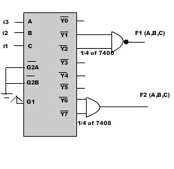

### Theory

<!-- Write the section content inside a paragraph element, we can also include images with &lt;img&gt; tag -->

 
                            
                            
Part1

             
                        
IC 74138 works as a 3-to-8 active low decoder,based on the values assigned to three select inputs of the three enable inputs, G1 must be made high value while G2A and G2B must be low. The eight active low inputs (Y0 to Y7) correspond to eight maxterms (M0 to M7) or in other words, component of the corresponding minterms m0-m7. For example, Y0 = component of C&nbsp;B&nbsp;A = C+B+A.  
                            

                             
                             
                            Figure 1&nbsp;(IC 74138)
                             
                             
                            
                           
 <table width="50%"  border="0" cellspacing="1px" cellpadding="2" bgcolor="#999999">
                             
<tr bgcolor="#FFFFCC">
                             <td>G2A</td>
                             <td>G2B</td>
                             <td>G1</td>
                             <td>C</td>
                             <td>B</td>
                             <td>A</td>
                             <td>Y0</td>
                             <td>Y1</td>
                             <td>Y2</td>
                             <td>Y3</td>
                             <td>Y4</td>
                             <td>Y5</td>
                             <td>Y6</td>
                             <td>Y7</td>
                             
 </tr>
                             
 <tr bgcolor="#FFFFCC">
                             <td>L</td>
                             <td >L</td>
                             <td >H</td>
                             <td>0</td>
                             <td>0</td>
                             <td>0</td>
                             <td>0</td>
                             <td>1</td>
                             <td>1</td>
                             <td>1</td>
                             <td>1</td>
                             <td>1</td>
                             <td>1</td>
                             <td>1</td>
                             
                             
</tr>
                             
                             
 <tr bgcolor="#FFFFCC">
                             <td>L</td>
                             <td >L</td>
                             <td >H</td>
                             <td>0</td>
                             <td>0</td>
                             <td>1</td>
                             <td>1</td>
                             <td>0</td>
                             <td>1</td>
                             <td>1</td>
                             <td>1</td>
                             <td>1</td>
                             <td>1</td>
                             <td>1</td>
                             
                             
</tr>
                             
                             
 <tr bgcolor="#FFFFCC">
                             <td>L</td>
                             <td >L</td>
                             <td >H</td>
                             <td>0</td>
                             <td>1</td>
                             <td>0</td>
                             <td>1</td>
                             <td>1</td>
                             <td>0</td>
                             <td>1</td>
                             <td>1</td>
                             <td>1</td>
                             <td>1</td>
                             <td>1</td>
                             
                             
 </tr>
                             
                             
 <tr bgcolor="#FFFFCC">
                             <td>L</td>
                             <td >L</td>
                             <td >H</td>
                             <td>0</td>
                             <td>1</td>
                             <td>1</td>
                             <td>1</td>
                             <td>1</td>
                             <td>1</td>
                             <td>0</td>
                             <td>1</td>
                             <td>1</td>
                             <td>1</td>
                             <td>1</td>
                             
                             
 </tr>
                             
  <tr bgcolor="#FFFFCC">
                             <td>L</td>
                             <td >L</td>
                             <td >H</td>
                             <td>1</td>
                             <td>0</td>
                             <td>0</td>
                             <td>1</td>
                             <td>1</td>
                             <td>1</td>
                             <td>1</td>
                             <td>0</td>
                             <td>1</td>
                             <td>1</td>
                             <td>1</td>
                            
                             
 </tr>
                             
  <tr bgcolor="#FFFFCC">
                             <td>L</td>
                             <td >L</td>
                             <td >H</td>
                             <td>1</td>
                             <td>0</td>
                             <td>1</td>
                             <td>1</td>
                             <td>1</td>
                             <td>1</td>
                             <td>1</td>
                             <td>1</td>
                             <td>0</td>
                             <td>1</td>
                             <td>1</td>
                             
                             
 </tr>
                             
                             
 <tr bgcolor="#FFFFCC">
                             <td>L</td>
                             <td >L</td>
                             <td >H</td>
                             <td>1</td>
                             <td>1</td>
                             <td>0</td>
                             <td>1</td>
                             <td>1</td>
                             <td>1</td>
                             <td>1</td>
                             <td>1</td>
                             <td>1</td>
                             <td>0</td>
                             <td>1</td>
                             
                             
</tr>
                             
                             
<tr bgcolor="#FFFFCC">
                             <td>L</td>
                             <td >L</td>
                             <td >H</td>
                             <td>1</td>
                             <td>1</td>
                             <td>1</td>
                             <td>1</td>
                             <td>1</td>
                             <td>1</td>
                             <td>1</td>
                             <td>1</td>
                             <td>1</td>
                             <td>1</td>
                             <td>0</td>
                             
                             
  </tr>
                             </table>
                              
                             Figure 2&nbsp;: Truth table for 3 to 8 decoder
                              
                              
                             
  
Part2

                             
 
Cascading two 74138 IC(Two 3 to 8 active low decoder) we can achieve a 4 to 16 active low decoder.
                              

                              
G2A and G2B inputs of the first IC(74138) and G1 input of 2nd IC(74138) are shorted and it acts as MSB of 4 binary select input .
                              G2A &amp;G2B of second IC(74138) is kept low.G1 of 1st IC is kept always high.

                             
   
                             
  
                             

Figure 3&nbsp;: 4 to 16 decoder  cascadeding two 3 to 8 decoder
                             

                              
                              
                             <table width="80%"  border="0" cellspacing="1px" cellpadding="2" bgcolor="#999999">
                             
<tr bgcolor="#FFFFCC">
                             <td colspan="4" width="30%">Select Inputs</td>
                             <td colspan="8">1st Decoder</td>
                             <td colspan="8">2nd Decoder</td>
                             </tr>
                             <tr bgcolor="#FFFFCC">
                             <td width="20%">D</td>
                             <td width="20%">C</td>
                             <td width="20%">B</td>
                             <td width="20%">A</td>
                             <td>Y0</td>
                             <td>Y1</td>
                             <td>Y2</td>
                             <td>Y3</td>
                             <td>Y4</td>
                             <td>Y5</td>
                             <td>Y6</td>
                             <td>Y7</td>
                             <td>Y0</td>
                             <td>Y1</td>
                             <td>Y2</td>
                             <td>Y3</td>
                             <td>Y4</td>
                             <td>Y5</td>
                             <td>Y6</td>
                             <td>Y7</td>
                             
                            
  </tr>
                                
                                
 <tr bgcolor="#FFFFCC">
                             <td >0</td>
                             <td>0</td>
                             <td >0</td>
                             <td>0</td>
                             <td>0</td>
                             <td>1</td>
                             <td>1</td>
                             <td>1</td>
                             <td>1</td>
                             <td>1</td>
                             <td>1</td>
                             <td>1</td>
                             <td>1</td>
                             <td>1</td>
                             <td>1</td>
                             <td>1</td>
                             <td>1</td>
                             <td>1</td>
                             <td>1</td>
                             <td>1</td>
                             
 </tr>
                             
                             
 <tr bgcolor="#FFFFCC">
                             <td>0</td>
                             <td >0</td>
                             <td >0</td>
                             <td>1</td>
                             <td>1</td>
                             <td>0</td>
                             <td>1</td>
                             <td>1</td>
                             <td>1</td>
                             <td>1</td>
                             <td>1</td>
                             <td>1</td>
                             <td>1</td>
                             <td>1</td>
                             <td>1</td>
                             <td>1</td>
                             <td>1</td>
                             <td>1</td>
                             <td>1</td>
                             <td>1</td>
                             
 </tr>
                             
                             
 <tr bgcolor="#FFFFCC">
                             <td>0</td>
                             <td >0</td>
                             <td >1</td>
                             <td>0</td>
                             <td>1</td>
                             <td>1</td>
                             <td>0</td>
                             <td>1</td>
                             <td>1</td>
                             <td>1</td>
                             <td>1</td>
                             <td>1</td>
                             <td>1</td>
                             <td>1</td>
                             <td>1</td>
                             <td>1</td>
                             <td>1</td>
                             <td>1</td>
                             <td>1</td>
                             <td>1</td>
                             
                             
 </tr>
                             
<tr bgcolor="#FFFFCC">
                             <td>0</td>
                             <td >0</td>
                             <td >1</td>
                             <td>1</td>
                             <td>1</td>
                             <td>1</td>
                             <td>1</td>
                             <td>0</td>
                             <td>1</td>
                             <td>1</td>
                             <td>1</td>
                             <td>1</td>
                             <td>1</td>
                             <td>1</td>
                             <td>1</td>
                             <td>1</td>
                             <td>1</td>
                             <td>1</td>
                             <td>1</td>
                             <td>1</td>
                             
                             
  </tr>
                             
 <tr bgcolor="#FFFFCC">
                             <td>0</td>
                             <td >1</td>
                             <td >0</td>
                             <td>0</td>
                             <td>1</td>
                             <td>1</td>
                             <td>1</td>
                             <td>1</td>
                             <td>0</td>
                             <td>1</td>
                             <td>1</td>
                             <td>1</td>
                             <td>1</td>
                             <td>1</td>
                             <td>1</td>
                             <td>1</td>
                             <td>1</td>
                             <td>1</td>
                             <td>1</td>
                             <td>1</td>
                             
                             
 </tr>
                             
                             
<tr bgcolor="#FFFFCC">
                             <td>0</td>
                             <td >1</td>
                             <td >0</td>
                             <td>1</td>
                             <td>1</td>
                             <td>1</td>
                             <td>1</td>
                             <td>1</td>
                             <td>1</td>
                             <td>0</td>
                             <td>1</td>
                             <td>1</td>
                             <td>1</td>
                             <td>1</td>
                             <td>1</td>
                             <td>1</td>
                             <td>1</td>
                             <td>1</td>
                             <td>1</td>
                             <td>1</td>
                             
                             
 </tr>
                             
                             
 <tr bgcolor="#FFFFCC">
                             <td>0</td>
                             <td >1</td>
                             <td >1</td>
                             <td>0</td>
                             <td>1</td>
                             <td>1</td>
                             <td>1</td>
                             <td>1</td>
                             <td>1</td>
                             <td>1</td>
                             <td>0</td>
                             <td>1</td>
                             <td>1</td>
                             <td>1</td>
                             <td>1</td>
                             <td>1</td>
                             <td>1</td>
                             <td>1</td>
                             <td>1</td>
                             <td>1</td>
                             
                             
 </tr>
                             
<tr bgcolor="#FFFFCC">
                             <td>0</td>
                             <td >1</td>
                             <td >1</td>
                             <td>1</td>
                             <td>1</td>
                             <td>1</td>
                             <td>1</td>
                             <td>1</td>
                             <td>1</td>
                             <td>1</td>
                             <td>1</td>
                             <td>0</td>
                             <td>1</td>
                             <td>1</td>
                             <td>1</td>
                             <td>1</td>
                             <td>1</td>
                             <td>1</td>
                             <td>1</td>
                             <td>1</td>
                             
                             
</tr>
                             
                             
                             
                             
                             
 <tr bgcolor="#FFFFCC">
                             <td>1</td>
                             <td >0</td>
                             <td >0</td>
                             <td>0</td>
                             <td>1</td>
                             <td>1</td>
                             <td>1</td>
                             <td>1</td>
                             <td>1</td>
                             <td>1</td>
                             <td>1</td>
                             <td>1</td>
                             <td>0</td>
                             <td>1</td>
                             <td>1</td>
                             <td>1</td>
                             <td>1</td>
                             <td>1</td>
                             <td>1</td>
                             <td>1</td>
                             
 </tr>
                             
                             
                             
                             
 <tr bgcolor="#FFFFCC">
                             <td>1</td>
                             <td >0</td>
                             <td >0</td>
                             <td>1</td>
                             <td>1</td>
                             <td>1</td>
                             <td>1</td>
                             <td>1</td>
                             <td>1</td>
                             <td>1</td>
                             <td>1</td>
                             <td>1</td>
                             <td>1</td>
                             <td>0</td>
                             <td>1</td>
                             <td>1</td>
                             <td>1</td>
                             <td>1</td>
                             <td>1</td>
                             <td>1</td>
                             
                             
</tr>
                             
                             
 <tr bgcolor="#FFFFCC">
                             <td>1</td>
                             <td >0</td>
                             <td >1</td>
                             <td>0</td>
                             <td>1</td>
                             <td>1</td>
                             <td>1</td>
                             <td>1</td>
                             <td>1</td>
                             <td>1</td>
                             <td>1</td>
                             <td>1</td>
                             <td>1</td>
                             <td>1</td>
                             <td>0</td>
                             <td>1</td>
                             <td>1</td>
                             <td>1</td>
                             <td>1</td>
                             <td>1</td>
                             
                             
  </tr>
                             
                             
 <tr bgcolor="#FFFFCC">
                             <td>1</td>
                             <td >0</td>
                             <td >1</td>
                             <td>1</td>
                             <td>1</td>
                             <td>1</td>
                             <td>1</td>
                             <td>1</td>
                             <td>1</td>
                             <td>1</td>
                             <td>1</td>
                             <td>1</td>
                             <td>1</td>
                             <td>1</td>
                             <td>1</td>
                             <td>0</td>
                             <td>1</td>
                             <td>1</td>
                             <td>1</td>
                             <td>1</td>
                             
                             
 </tr>
                             
                             
                             
<tr bgcolor="#FFFFCC">
                             <td>1</td>
                             <td >1</td>
                             <td >0</td>
                             <td>0</td>
                             <td>1</td>
                             <td>1</td>
                             <td>1</td>
                             <td>1</td>
                             <td>1</td>
                             <td>1</td>
                             <td>1</td>
                             <td>1</td>
                             <td>1</td>
                             <td>1</td>
                             <td>1</td>
                             <td>1</td>
                             <td>0</td>
                             <td>1</td>
                             <td>1</td>
                             <td>1</td>
                             
                             
 </tr>
                             
                             
                             
<tr bgcolor="#FFFFCC">
                             <td>1</td>
                             <td >1</td>
                             <td >0</td>
                             <td>1</td>
                             <td>1</td>
                             <td>1</td>
                             <td>1</td>
                             <td>1</td>
                             <td>1</td>
                             <td>1</td>
                             <td>1</td>
                             <td>1</td>
                             <td>1</td>
                             <td>1</td>
                             <td>1</td>
                             <td>1</td>
                             <td>1</td>
                             <td>0</td>
                             <td>1</td>
                             <td>1</td>
                             
</tr>
                             
                             
 <tr bgcolor="#FFFFCC">
                             <td>1</td>
                             <td >1</td>
                             <td >1</td>
                             <td>0</td>
                             <td>1</td>
                             <td>1</td>
                             <td>1</td>
                             <td>1</td>
                             <td>1</td>
                             <td>1</td>
                             <td>1</td>
                             <td>1</td>
                             <td>1</td>
                             <td>1</td>
                             <td>1</td>
                             <td>1</td>
                             <td>1</td>
                             <td>1</td>
                             <td>0</td>
                             <td>1</td>
                             
                             
 </tr>
                             
                             
  <tr bgcolor="#FFFFCC">
                             <td>1</td>
                             <td >1</td>
                             <td >1</td>
                             <td>1</td>
                             <td>1</td>
                             <td>1</td>
                             <td>1</td>
                             <td>1</td>
                             <td>1</td>
                             <td>1</td>
                             <td>1</td>
                             <td>1</td>
                             <td>1</td>
                             <td>1</td>
                             <td>1</td>
                             <td>1</td>
                             <td>1</td>
                             <td>1</td>
                             <td>1</td>
                             <td>0</td>
                             
                             
 </tr>
                             
                             
                             
                             
                             
 </table>
                             
  
                              
Figure 4&nbsp;: Truth table for 4 to 16 decoder

                              
                              
                              
 

                             
                             
 
                              

Part 3

A decoder with active high outputs generates minterms. Whereas, a decoder with active low outputs generates maxterms (i.e.  complements of
the corresponding minterm).
Thus, if a function is specified as a sum of minterms or equivalently as a product of maxterms, 
it can be realized by a decoder with active low outputs and additional AND/NAND gates. 
 

For example, consider the following
 

F1 (A,B,C) = &Sigma; m (1,2)
 

F2 (A,B,C) = &Sigma; m (0,1,2,3,4,5)

 

     

                           
                        

                    </section>